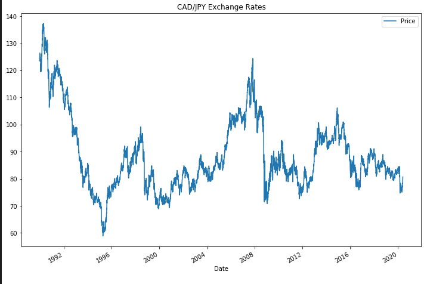

# Unit 10 — A Yen for the Future

- - -

### Files

[Time-Series Starter Notebook](Time_Series_Analysis/time_series_analysis.ipynb)

[Linear Regression Starter Notebook](Time_Series_Analysis/regression_analysis.ipynb)

[CAD/JPY Data CSV File](Time_Series_Analysis/cad_jpy.csv)

- - -

### Process and Workflow

## Time-Series Forecasting

In this notebook, I loaded the historical CAD-JPY exchange rate data and applied time series analysis and modelling to determine if there is any predictable behaviour.

### Outlined are the steps applied to complete the time series analysis:

1. Imported library for current project. 

2. Loaded csv file and created a dataframe.

3. Trimmed the dataset to begin on January 1st, 1990

4. Created a series using "Price" percentage returns, drop any nan"s, and check the results.
   
5. Created a lagged return using the shift function
    
6. Created a train/test split for the data using 2018-2019 for testing and the rest for training
 
7. Created four dataframes: 

    a. X_train (training set using just the independent variables), X_test (test set of of just the independent variables).

    b. Y_train (training set using just the "y" variable, i.e., "Futures Return"), Y_test (test set of just the "y" variable)

    c. Initialized data for checking.

8. Linear Regression Model.

    a. Made a prediction of "y" values using just the test dataset

    b. Assembled actual y data (y_test) with predicted y data into two columns in a dataframe 
    fit (p < 0.05)?

    c. Plotted the first 20 predictions vs the true values.

### Q&A 

Q1. Does this model perform better or worse on out-of-sample data as compared to in-sample data?

   
    A:  Results:

        Out-of-Sample Root Mean Squared Error (RMSE): 0.6445805658569028

        In-sample Root Mean Squared Error (RMSE): 0.841994632894117

        Based on the results. The model performs better on the out-of-sample data compared to the in-sample data. Perfomance is better if you have a low RMSE. In this case, out-of-sample data has a lower RMSE as compared to the in-sample data. 
   

## Linear Regression Forecasting

In this notebook, I built a Scikit-Learn linear regression model to predict CAD/JPY returns with *lagged* CAD/JPY futures returns and categorical calendar seasonal effects (e.g., day-of-week or week-of-year seasonal effects).

### Outlined are the steps applied to complete the linear regression:

1. Imported library for current project. 

2. Loaded csv file and created a dataframe.

3. Trimmed the dataset to begin on January 1st, 1990.

4. Data preparation (creating returns and lagged returns, and splitting the data into training and testing data).

5. Created four dataframes: 

    a. X_train (training set using just the independent variables), X_test (test set of of just the independent variables).

    b. Y_train (training set using just the "y" variable, i.e., "Futures Return"), Y_test (test set of just the "y" variable)

    c. Initialized data for checking.

6. Linear Regression Model:

    a. Created a Linear Regression model and fit it to the training data.

    b. Fitted a SKLearn linear regression using  just the training set (X_train, Y_train)

    c. Made a prediction of "y" values using just the test dataset.

    d. Assembled actual y data (y_test) with predicted y data into two columns in a dataframe.

    e. Plotted the first 20 predictions vs the true values.

7. Out-of Sample Performance

    a. Calculated the mean_squared_error (MSE) on actual versus predicted test "y"/

    b. Used the mean-squared-error and calculated the root-mean-squared error (RMSE).

8. In-Sample Performance

    a. Constructed a dataframe using just the "y" training data

    b. Added a column of "in-sample" predictions to that dataframe:  

    c. Calculated in-sample mean_squared_error (for comparison to out-of-sample)

    d. Calculated in-sample root mean_squared_error (for comparison to out-of-sample)

### Q&A

Q1. Based on your time series analysis, would you buy the yen now?

    A: Based on the time series analysis the price is expected to go below 80. Then it is not a good time to buy as it indicates that the JPY price appreciating. 

Q2. Is the risk of the yen expected to increase or decrease?

    A: Based on the Garch Model, the volatility is expected to increase over the next few days. 

Q3. Based on the model evaluation, would you feel confident in using these models for trading?

 

    A: Further evaluation is needed to make a proper analysis. As of the moment, based on the data it is likely that the JPY price will appreciate compared to the Canadian dollar. Furthermore, both ARMA and ARIMA p values are higher than 0.05. I am not confident in using these models for trading.

- - -

